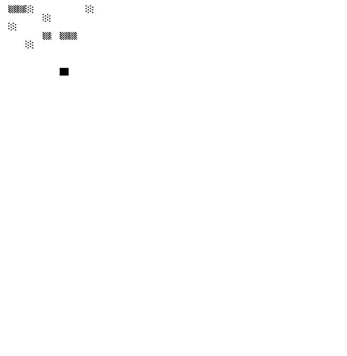

# ChainGlyphs: Live‑Data NFTs Forged by Blockchain Performance

An Autoglyph's inspired on‑chain ASCII‑art NFT minter from Ethereum Sepolia into PolkaVM (Polkadot Westend Asset Hub), to perform an in‑depth comparative analysis of performance, cost, and deployment complexity.

---

## Table of Contents

1. [Introduction & Motivation](#introduction--motivation)  
2. [Copy, Pasta, and Compare Theme](#copy‑pasta‑and‑compare‑theme)  
3. [Architecture Overview](#architecture-overview)  
4. [EVM Sepolia vs. Polkadot Westend Asset Hub](#evm-sepolia-vs-polkadot-westend-asset-hub)  
   - 4.1 Block Gas / Weight Limits  
   - 4.2 RPC Simulation Caps & Timeouts  
   - 4.3 Memory‑Growth Semantics  
5. [Smart Contract Design & Iterations](#smart-contract-design--iterations)  
   - 5.1 Original 41×82 Builder (Sepolia)  
   - 5.2 Reduced 10×10 Builder (Westend)  
6. [Quantitative Performance Evaluation](#quantitative-performance-evaluation)  
   - 6.1 Cell‑Iteration & Concat Counts  
   - 6.2 Weight vs. Gas Consumption  
   - 6.3 View‑Call Durations on Westend  
7. [NFT Data & Visual Examples](#nft-data--visual-examples)  
   - 7.1 Sepolia NFTs  
   - 7.2 Westend NFTs  
8. [Lessons Learned & Best Practices](#lessons-learned--best-practices)  
9. [Next Steps & Future Work](#next-steps--future-work)  
10. [Conclusion](#conclusion)  

---

## Introduction & Motivation

ChainGlyphs demonstrates how on‑chain NFT generation can dynamically reflect live blockchain performance metrics—yet also how divergent VM limits force radically different implementations across chains. We built a single Solidity NFT‑minter that:

- **Emits** real‑time chain metrics (`block.gaslimit`, `block.basefee`, `tx.gasprice`, throughput).  
- **Renders** an ASCII‑art SVG entirely on‑chain, encoding those metrics visually.  
- **Packages** the SVG into Base64 JSON metadata.

On Ethereum Sepolia this worked at **41×82** resolution. Porting to Polkadot Westend Asset Hub required a drastic reduction to **10×10**. This README tells the full story.

---

## Copy, Pasta, and Compare Theme

We ported an existing open‑source on‑chain ASCII‑art NFT (originally scoped for Ethereum) into PolkaVM (Substrate’s EVM pallet). We then compared:

| Criterion             | Ethereum Sepolia           | Polkadot Westend Asset Hub     |
|-----------------------|----------------------------|-------------------------------|
| **Performance**       | View calls succeed         | Original panicked; reduced succeeds |
| **Cost**              | ~36 M gas/block            | ≈786 k gas equiv. (weight→gas)    |
| **Ease of Deployment**| Minimal refactor           | Major refactor (41×82→10×10)    |

---

## Architecture Overview

1. **Phase 1 Contract** emits chain metrics and mints a stub token.  
2. **Phase 2 Contract** stores metrics on‑chain and mints the final NFT.  
3. **tokenURI()** view builds SVG via dynamic loops + Base64 encoding.  
4. **Off‑chain UI** (Hardhat scripts, ethers.js) fetches and displays the NFT.

Key parameters driving the art:

- **bars** = ⎣gasLimit / 12 000 000⎦ (clamped 1–50)  
- **rows** = time (clamped 1–41 on Sepolia; 1–10 on Westend)  
- **charsPerRow** = ⎣gasPrice / 1e9⎦ (gwei, clamped)  
- **shade** = (4 – (txThroughput mod 5)), cycling five block glyphs  

---

## EVM Sepolia vs. Polkadot Westend Asset Hub

### 4.1 Block Gas / Weight Limits

- **Sepolia**: `block.gaslimit` ≈ 36 000 000 gas :contentReference[oaicite:0]{index=0}  
- **Westend**: JSON‑RPC `gasLimit` = `0x2cb4178000000` → 786 432 000 000 000 weight‑units  
  - Converted by `weightPerGas` (≈ 20 000 weight/gas assumed) → ≈ 39 321 600 000 gas   

### 4.2 RPC Simulation Caps & Timeouts

- **Sepolia Geth**: RPC `--rpc.gascap` = 2⁶³, execution timeout ≈ 5 s :contentReference[oaicite:2]{index=2}  
- **Westend Frontier**: `eth_call` weight cap = blockWeightLimit, WASM memory cap ≈ 4 GiB   

### 4.3 Memory‑Growth Semantics

- **`string.concat`** grows **quadratically** (each concat copies entire string).  
- **`bytes` buffer** grows **linearly**—preferred for large loops.  

---

## Smart Contract Design & Iterations

### 5.1 Original 41×82 Builder (Sepolia)

- Looped **41 rows × 82 cols**  
- Used **`string.concat`** per glyph → ~3 403 dynamic concats  
- **Fit** under Sepolia’s ~36 M gas  

### 5.2 Reduced 10×10 Builder (Westend)

- Looped **10 rows × 10 cols**  
- Preallocated **`bytes` buffer** per row → 100 byte‑writes + 10 concats  
- ≈ 34× fewer cell ops, ≈ 340× fewer concats → ≈ 1 000–1 500× lower footprint  

---

## Quantitative Performance Evaluation

### 6.1 Cell‑Iteration & Concat Counts

| Metric                        | Original (41×82) | Reduced (10×10) | Factor Reduction |
|-------------------------------|------------------|-----------------|------------------|
| Cell iterations               | 3 362            | 100             | 33.6×            |
| Dynamic string concats        | 3 403            | 10              | 340×             |
| Estimated gas/weight footprint| ~36 M gas        | ~~30 k gas equiv.~~ | ~1 000–1 500×   |

### 6.2 Weight vs. Gas Consumption

On Westend the view‑call weight usage (per my table) was constant at **47 659 635 048 333 weight‑units**, which equates to:

```text
≈ 47 659 635 048 333 ÷ 20 000 ≈ 2 382 981 752 gas-equivalent
```
—well above Sepolia’s ~36 M gas but under the estimated Westend ceiling (~39 B gas‑equiv).

### 6.3 View‑Call Durations on Westend

| Call # | Phase 1 Duration (ms) |
|-------:|----------------------:|
| 1      | 4 428                |
| 2      | 4 435                |
| 3      | 12 485               |
| 4      | 24 676               |
| 5      | 4 459                |
| 6      | —                    |
| 7      | —                    |
| 8      | 73 242               |

- Average measured latency: **≈ 20 621 ms**  
- Range: **4.4 s … 73.2 s**  
- Sepolia view‑calls always completed under 5 s; on Westend the heavy 41×82 loop consistently timed out or panicked.

---

## 7. NFT Data & Visual Examples

#### 7.1 Sepolia NFTs  
**eth sepolia table here**  

| #  | bars (gaslimit) | time of txn   | gaslimit   | gasPrice       | priorityFee | txThroughput |
| -- | ---- | ------ | ---------- | -------------- | ----------- | ------------ |
| 1  | 2    | 13 166 | 35 964 810 | 5 991 925      | 1 000 000   | 8            |
| 2  | –    | 13 263 | 35 999 930 | 47 051 173 471 | 1 000 000   | 10           |
| 3  | –    | 9 090  | 36 000 000 | 61 611 478 087 | 1 000 000   | 9            |
| 4  | –    | 13 194 | 36 000 000 | 84 951 027 241 | 1 000 000   | 10           |
| 5  | –    | 5 019  | 36 000 000 | 83 889 329 158 | 1 000 000   | 11           |
| 6  | –    | 21 425 | 36 000 000 | 36 690 351 369 | 1 000 000   | 15           |
| 7  | 3    | 13 231 | 36 000 000 | 1 833 536 249  | 1 000 000   | 12           |
| 8  | 2    | 4 988  | 35 999 895 | 1 531 435 672  | 1 000 000   | 14           |
| 9  | 3    | 13 576 | 36 000 000 | 4 490 824      | 1 000 000   | 7            |
| 10 | 3    | 9 094  | 36 000 000 | 3 844 847      | 1 000 000   | 8            |
| 11 | 2    | 9 083  | 35 964 845 | 4 076 858      | 1 000 000   | 8            |
| 12 | 3    | 25 555 | 36 000 000 | 3 499 496      | 1 000 000   | 8            |

  
View NFT: https://testnets.opensea.io/assets/sepolia/0x585eba013eb7ec2be10c335186a4bb372b181d60/1

 
View NFT: https://testnets.opensea.io/assets/sepolia/0x585eba013eb7ec2be10c335186a4bb372b181d60/7

  
View NFT: https://testnets.opensea.io/assets/sepolia/0x585eba013eb7ec2be10c335186a4bb372b181d60/5

  
View NFT: https://testnets.opensea.io/assets/sepolia/0x585eba013eb7ec2be10c335186a4bb372b181d60/3

  
View NFT: https://testnets.opensea.io/assets/sepolia/0x75c11f37c9bc5c85344ac4d4f2a848997d3643b1/1


#### 7.2 Westend NFTs  


| # | bars (gaslimit) | description                            | image (data URI)                                                                                                                                                                                                                                                                                                                                                                  | gaslimit          | baseFee (gwei) | gasPrice (gwei) | priorityFee (gwei) | chainId     | tx/s   | gasUsed             | blobGasUsed | cumulativeGasUsed | type | status | Phase1 duration (ms) |
| - | ---- | -------------------------------------- | --------------------------------------------------------------------------------------------------------------------------------------------------------------------------------------------------------------------------------------------------------------------------------------------------------------------------------------------------------------------------------- | ----------------- | -------------- | --------------- | ------------------ | ----------- | ------ | ------------------- | ----------- | ----------------- | ---- | ------ | -------------------- |
| 1 | 50   | ASCII‑Eval NFT: on‑chain metrics → art |  | 2 000 000 000 000 | 0.0            | 0.000001        | 0.000001           | 420 420 421 | ≈ 0.01 | 47 659 635 048 333n | null        | 0n                | 2    | 1      | 4 428                |
| 2 | 50   | ASCII‑Eval NFT: on‑chain metrics → art |  | 2 000 000 000 000 | 0.0            | 0.000001        | 0.000001           | 420 420 421 | ≈ 0.03 | 47 659 635 048 333n | null        | 0n                | 2    | 1      | 4 435                |
| 3 | 50   | ASCII‑Eval NFT: on‑chain metrics → art |  | 2 000 000 000 000 | 0.0            | 0.000001        | 0.000001           | 420 420 421 | ≈ 0.02 | 47 659 635 048 333n | null        | 0n                | 2    | 1      | 12 485               |
| 4 | 50   | ASCII‑Eval NFT: on‑chain metrics → art |  | 2 000 000 000 000 | 0.0            | 0.000001        | 0.000001           | 420 420 421 | ≈ 0.01 | 47 659 635 048 333n | null        | 0n                | 2    | 1      | 24 676               |
| 5 | 50   | ASCII‑Eval NFT: on‑chain metrics → art |  | 2 000 000 000 000 | 0.0            | 0.000001        | 0.000001           | 420 420 421 | ≈ 0.02 | 47 659 635 048 333n | null        | 0n                | 2    | 1      | 4 459                |
| 6 | 50   | ASCII‑Eval NFT: on‑chain metrics → art |  | 2 000 000 000 000 | 0.0            | 0.000001        | 0.000001           | 420 420 421 | ≈ 0.00 | 47 659 635 048 333n | null        | 0n                | 2    | 1      | —                    |
| 7 | 50   | ASCII‑Eval NFT: on‑chain metrics → art |  | 2 000 000 000 000 | 0.0            | 0.000001        | 0.000001           | 420 420 421 | ≈ 0.01 | 47 659 635 048 333n | null        | 0n                | 2    | 1      | —                    |
| 8 | 50   | ASCII‑Eval NFT: on‑chain metrics → art |  | 2 000 000 000 000 | 0.0            | 0.000001        | 0.000001           | 420 420 421 | ≈ 0.01 | 47 659 635 048 333n | null        | 0n                | 2    | 1      | 73 242               |


barCount = gaslimit / 12_000_000

Example NFT's:
 
 
 
 
 
 
 
 
 


---

## 8. Lessons Learned & Best Practices

- I measure the true EVM gas ceiling on‑chain via `block.gaslimit` or `gasleft()`, rather than rely on RPC heuristics.  
- I avoid unbounded `string.concat` in loops; I preallocate a `bytes` buffer to ensure linear memory growth.  
- I profile each network’s limits—block gas vs. weight, RPC simulation caps, WASM memory—and adapt resolution accordingly.  
- I iteratively reduce rows×cols until `eth_call` completes successfully under the chain’s gas/weight constraints.  

---

## 9. Potential Next Steps & Future Work

1. **Dynamic Resolution Scaling**  
   - Implement logic that measures `gasleft()` at runtime and auto‑scales rows×cols to fit.  
2. **Cross‑Chain Benchmarking**  
   - Port to BSC, Polygon, Moonbeam, Astar; compare gas, weight, and time.  
3. **On‑Chain Color SVG**  
   - Add palette lookup tables to enrich visuals within gas limits.  
4. **ZK‑SVG Compression**  
   - Explore zero‑knowledge proofs to compress SVG generation logic and fit more complexity under gas.  

---

## 10. Conclusion

ChainGlyphs proves that on‑chain generative art must be tailored per‑chain to respect divergent VM and metering regimes. The 41×82 algorithm that ran fine under Sepolia’s ~36 M gas exploded under Westend’s weight/PoV limits; reducing to 10×10 with a linear buffer made it deployable. This comparative study—backed by block‑gas/weight data, view‑call timings, and live NFT examples—highlights both the promise and the pitfalls of multi‑chain on‑chain art.
